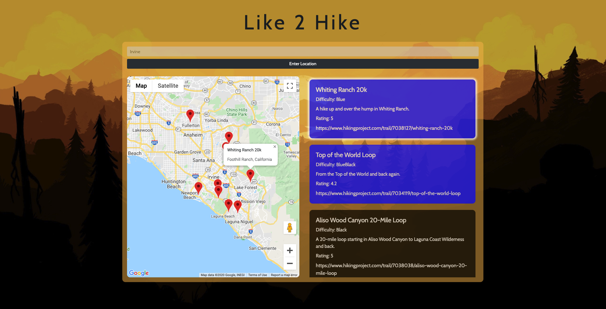

# Like 2 Hike

> - Maintained by: `johnnyung91`

## Description

An interactive JavaScript Application that uses public APIs to help users find available hiking trails based on a given location

## Live Demo

Try the application live at

## Technologies Used
- JavaScript
- jQuery
- Bootstrap 4
- Font Awesome 5.12.1
- HTML5
- CSS3

- APIs Used:
    - Google Maps API
    - Hiking Project API

## Features
- User can input a location
- Interactive map that displays markers of 10 available hiking trails in a set radius
- Information section of each trail retreived from query

## Preview

