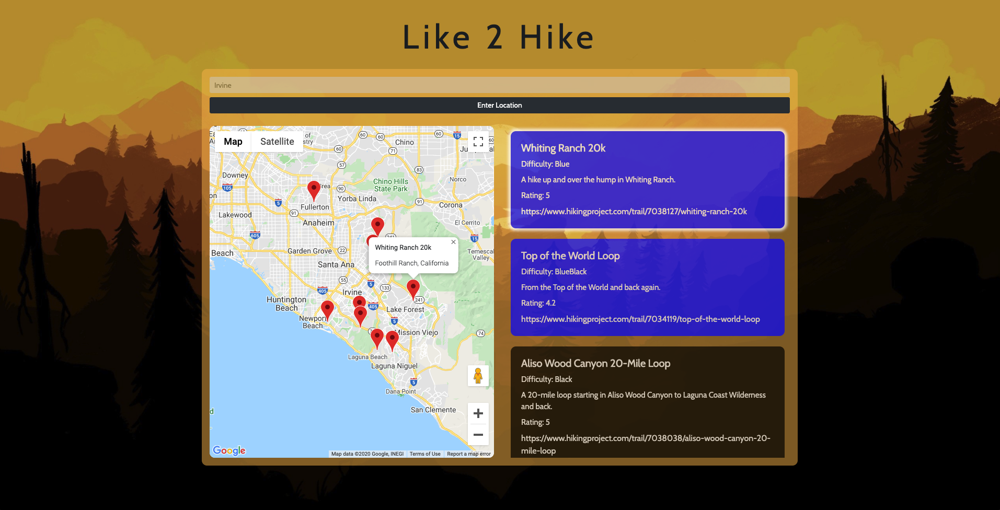

# Like 2 Hike
An interactive JavaScript Application that uses the [Google Maps API](https://developers.google.com/maps/documentation/javascript/tutorial) and the [Hiking Project Data API](https://www.hikingproject.com/data) to help users find available hiking trails based on a given location.

## Live Demo
Try the application live at: https://like2hike.johnnyungcodes.com/

## Technologies Used
- JavaScript
- jQuery (AJAX)
- Node.js
- Express
- Bootstrap 4
- Font Awesome 5.12.1
- HTML5
- CSS3

## Features
- Location input field that automatically adjusts input values to geocode information.
- Interactive map that displays markers of 10 available hiking trails in a set radius
- Information section of each trail retreived from query
- Mobile Responsive: compatible in portrait and landscape mode for iPhone 6/7/8 and iPad

## Preview


#### Getting Started

1. Clone the repository and change into directory

    ```shell
    git clone https://github.com/johnnyung91/like-2-hike.git

    cd like-2-hike
    ```
2. Install dependencies using NPM.

    ```shell
    npm install
    ```
3. Register for personal API keys at: [Google Maps API](https://developers.google.com/maps/documentation/javascript/tutorial) and [Hiking Project Data API](https://www.hikingproject.com/data)
4. Create a ```.env``` file using provided ```.env.example``` as a template.  Insert new value for ```hiking_APIKey``` with personal API key from Hiking Project API.
    ```shell
    PORT=3001
    DEV_SERVER_PORT=3000
    hiking_APIKey=YOUR_API_KEY
    ```
5. Open ```index.html``` and substitute Google Maps API key with your own personal API.
    ```html
    <script async defer
      src="https://maps.googleapis.com/maps/api/js?key=YOUR_API_KEY">
    </script>
    ```
6. Start the application by initializing Node server using the following command line.  Once started, the application can be viewed by visiting https://localhost:3001 in your browser.
    ```shell
    npm run dev
    ```
